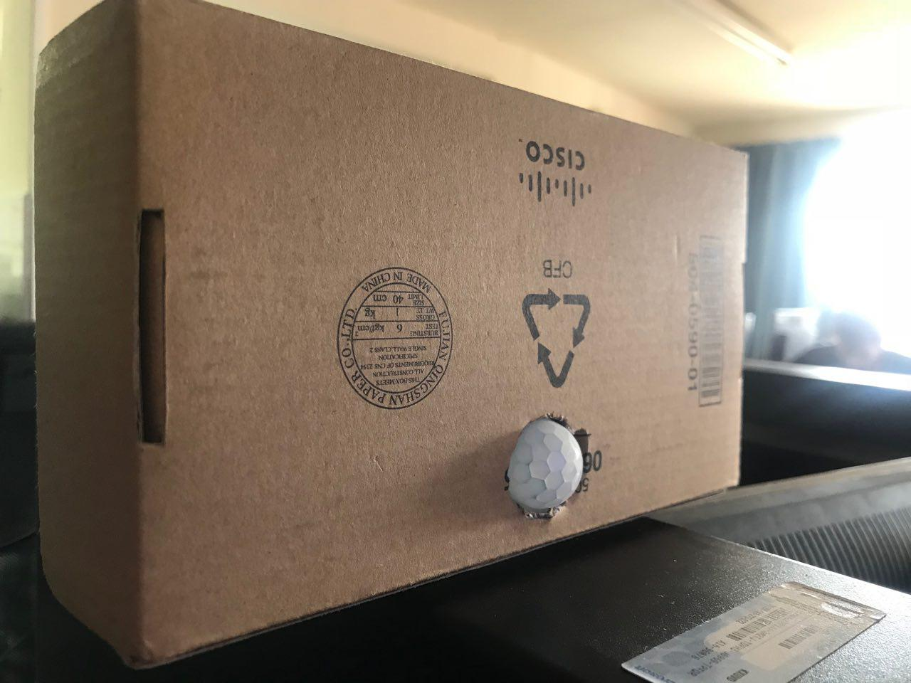

# Proyecto Arduino por Hakim y Eros
- Arduino Nano.
- Protoboard.
- Pantalla LCD.
- Detector de movimiento.


```C++
//YWROBOT
//Compatible with the Arduino IDE 1.0
//Library version:1.1

#include <Wire.h> 
#include <LiquidCrystal_I2C.h>

LiquidCrystal_I2C lcd(0x27,20,4);  // set the LCD address to 0x27 for a 16 chars and 2 line display
const int LEDPin = 13;        // pin para el LED
const int PIRPin = 2;         // pin de entrada (for PIR sensor)
 
int pirState = LOW;           // de inicio no hay movimiento
int val = 0;  ;
 
void setup()
{
 pinMode(LEDPin, OUTPUT); 
   pinMode(PIRPin, INPUT);
   Serial.begin(9600);
  lcd.init();                      // Iniciamos la pantalla.
  lcd.init();
                          // Mostramos mensaje predeterminado en pantalla.
  lcd.backlight();
  lcd.setCursor(4,0);
  lcd.print("ALARMA CEBEM");
  lcd.setCursor(5,1);
  lcd.print("25/05/2018");
  lcd.setCursor(4,2);
  lcd.println("Hakim & Eros");
   
}
 
void loop()
{
   val = digitalRead(PIRPin);
   if (val == HIGH)   // Si está activado.
   { 
      digitalWrite(LEDPin, HIGH);  // LED ON
      if (pirState == LOW)  // Si previamente estaba apagado.
      {
         lcd.setCursor(0,3);
        lcd.println("Movimiento Detectado"); // Muestra el mensaje respuesta.
        pirState = HIGH;
      }
   } 
 else   //si esta desactivado
   {
      digitalWrite(LEDPin, LOW); // LED OFF
      if (pirState == HIGH)  // Si previamente estaba encendido.
      {
        lcd.setCursor(2,1);
        lcd.println("No hay movimiento"); // Muestra el mensaje respuesta.
        pirState = LOW;
      }
   }
}

```
___
### Imágenes


### Imágenes

___
### Funcionalidad
Este sistema funciona de tal manera, que cuando el detector detecta movimiento muestra un mensaje de alerta en la pantalla.
